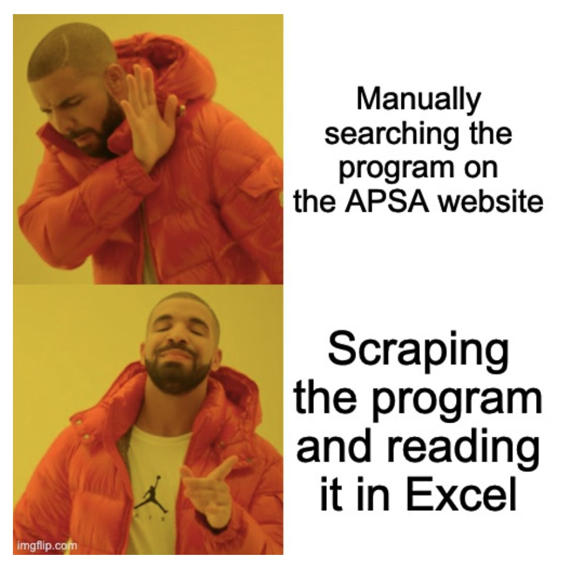
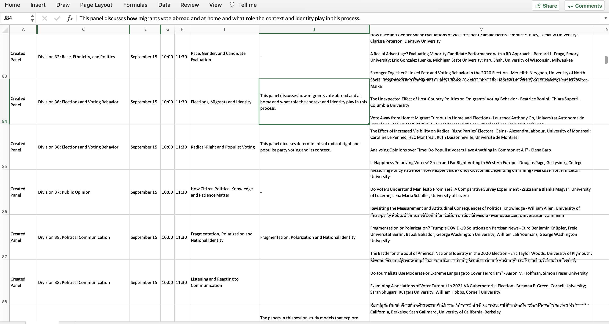

<!-- README.md is generated from README.Rmd. Please edit that file -->

```{r, include = FALSE}
knitr::opts_chunk$set(
  collapse = TRUE,
  comment = "#>"
)
```

# Program of the APSA 2022




If you are tired of scrolling through the [APSA program](https://convention2.allacademic.com/one/apsa/apsa22/index.php) or waiting for the page to load, this repo is for you. 

This repo only contains one folder with the program in tabular format ([csv](https://github.com/benjaminguinaudeau/apsa2022/raw/master/data/all_panels_wide.csv) and [xlsx](https://github.com/benjaminguinaudeau/apsa2022/raw/master/data/all_panels_wide.xlsx)). You can download it and enjoy your APSA experience!

More data has been collected (parsed authors and universities ; abstract). I do not need it for now, but if you are interested in this kind of data, feel free to get in touch. 



